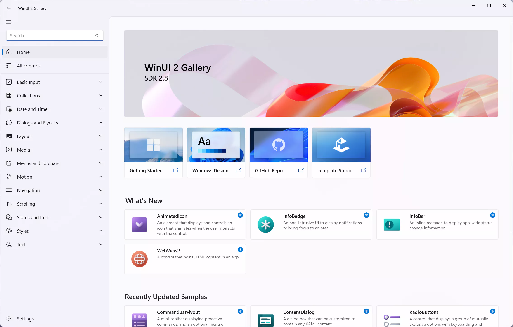
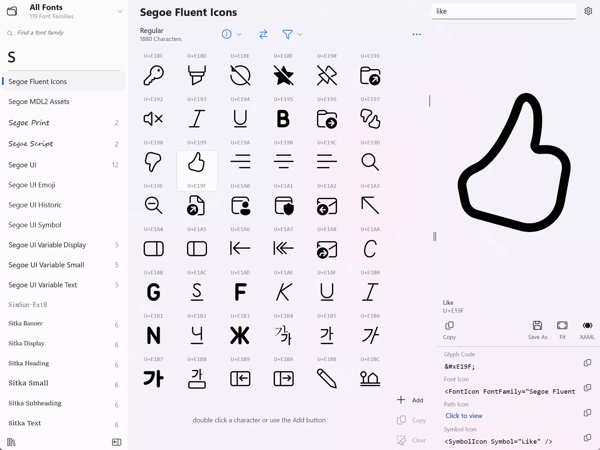

# WinUI 3 踩坑记

WinUI 3 ([Windows App SDK](https://github.com/microsoft/WindowsAppSDK) 于 2021 年 11 月发布了第一个正式版 v1.0.0 [[1]](#参考)，最新版本是 v1.1.5 [[2]](#参考)。我的基于 WinUI 3 的个人项目 [寻空](https://github.com/xunkong/xunkong) 从年初开始开发 [[3]](#参考)，完整经历了 WinUI 3 的各个版本，见证了从 Bug 满天飞到逐渐完善的全过程。

现在 WinUI 3 趋于稳定，处于可以一用的状态，我也想把开发寻空过程中遇到的有趣的内容分享给大家，系列名就叫 **WinUI 3 踩坑记** 好了。个人水平有限，文章中难免会出现错误，请各位读者批评指正。

## 目录

[目录](./Catalog.md)

## WinUI 3 是什么

WinUI 3 是 Windows App SDK 内的**本机 UI 平台组件**，那这个 Windows App SDK 又是什么东西，和 Windows SDK 有什么关系，是不是改名部的新操作？

按照微软的文档所说，Windows App SDK 是一组新的开发人员组件和工具，它们代表着 Windows 应用开发平台的下一步发展方向，Windows App SDK 不会代替 Windows SDK 或现有桌面 Windows 应用类型（比如 WinForm、WPF、Win32），而是使用一组通用 API 来补充这些现有工具和应用类型，开发人员可以在这些平台上依赖这些 API 来执行操作 [[4]](#参考)。

~~微软的文档真不讲人话，~~ 简单来说，WinUI 3 是 Windows 平台最新一代本机应用开发框架，继承了 UWP 的设计语言和 Win32 的运行方式，同时结合了两者的优点，但是也带来了只能跑在 Windows 10 1809 (17763) 及以上版本的限制。

## WinUI 3 的优缺点

以下内容总结自我个人的开发体验，仅为一家之言。

### 优点

- **颜值高。** 我选择 WinUI 3 的最重要的原因就是外观，WinUI 3 使用了和 UWP 相同的 UI 框架，完美实现了 Fluent Design 设计语言，控件自带动画效果，也能够使用亚克力和云母材质，适合我这种没有 UI 设计能力的。
- **性能好。** .NET 6 的性能毋庸置疑。
- **权限高。** WinUI 3 本质上是一个 Win32 应用，没有了 UWP 中严格的权限限制，可以放开手脚随便来。

### 缺点

- **开发体验差。** 到现在还没有设计器，只能对着一个 XAML 文件空写，为此我已经练就了一套脑内渲染本领。其次是编译速度慢，真的非常慢。
- **安装包体积大。** 发布 WinUI 3 项目必须包含 .NET 运行时，并且暂时还不支持剪裁，一个禁用 ReadyToRun 编译的 WinUI 3 空项目安装包就有 40.6 MB，启用 ReadyToRun 后更是膨胀到 51.5 MB。(Windows App SDK v1.1.4 x64)
- **互操作性能差。** .NET 6 的性能确实毋庸置疑，**但是** WinUI 是一个 Native 框架，对控件依赖属性的读写需要通过 CsWinRT 互操作，经过测试要比 WPF 要慢很多 [[5]](#参考)。
- **生态差。** WinUI 3 正式发布不到一年，第三方控件还很少，大部分情况下需要自己写控件。

> 安装包体积大和互操作性能差仅对于 C# 而言，C++ 开发的 WinUI 3 应用没有这些问题。

总的来说，WinUI 3 是一个未来可期的框架，既有颜值也有体验（当然不是指开发体验）。但是 WinUI 3 本身很难开发高性能的生产力软件，这注定了它不太可能在大型商业软件领域有所作为。而在更广阔的娱乐或工具应用中，WinUI 3 可能会成为一部分新项目的选择，比如 [爱奇艺 Preview](https://www.microsoft.com/store/apps/9NBLGGH4NBXB) 。WinUI 3 的未来到底如何，我们拭目以待。

## 关于本系列

- **WinUI 3 踩坑记** 不是完整的系列教程，只是和 WinUI 3 相关随笔的合集
- 本系列默认读者了解
    - C# 11 和 XAML 的语法
    - .NET 6 Runtime API
    - WinUI 控件和 WinRT API
    - Win32 窗口相关知识
- 若无特殊说明，本系列文章中代码的环境为 `Windows 11 22H2 (22621) x64`, `C# 11 (.NET 6)`, `Windows App SDK v1.1.5`
- 系列的所有文章和代码都存档于 [GitHub@Scighost/WinUI3Keng](https://github.com/Scighost/WinUI3Keng)，若出现冲突以 GitHub 上的为准

## 开发工具

除了在 Visual Studio 中必装的负载以外，推荐几个提升效率的工具。

[**Microsoft UI Xaml**](https://github.com/microsoft/microsoft-ui-xaml)         
WinUI 控件样式源码，这算是必看内容之一。开发中遇到的一些问题，比如 NavigationView 的背景色怎么修改、CheckBox 为什么这么宽、怎么去掉 ListView 选中时的效果 这些问题都可以通过修改控件样式解决。

[**Windows Community Toolkit Sample App**](https://www.microsoft.com/store/productId/9NBLGGH4TLCQ)      
[社区工具箱](https://github.com/CommunityToolkit/WindowsCommunityToolkit)，开发 WinUI 基本离不开这个东西。

[**WinUI Gallery**](https://github.com/microsoft/WinUI-Gallery)       
这是官方的控件展示，WinUI 的所有自带的控件都能在里面找到用法。有 [WinUI 2](https://www.microsoft.com/store/apps/9MSVH128X2ZT) 和 [WinUI 3](https://www.microsoft.com/store/apps/9P3JFPWWDZRC) 两个版本，内容差不多，我觉得 WinUI 2 版的比较好用。

[**Character Map UWP**](https://www.microsoft.com/store/apps/9WZDNCRDXF41)      
字符映射表，一个查看和搜索字体字符的工具。开发过程中经常要查找一些字体图标，在这个应用中都能很方便地找到，还能直接复制生成的代码。

## 参考

- [1] [Windows App SDK v1.0.0](https://github.com/microsoft/WindowsAppSDK/releases/tag/v1.0)
- [2] [Windows App SDK v1.1.5](https://github.com/microsoft/WindowsAppSDK/releases/tag/v1.1.5)
- [3] [Xunkong: First commit](https://github.com/xunkong/xunkong/commit/4f377649a5004b595e99daae96d52ad9285f980a)
- [4] [Windows App SDK Document](https://docs.microsoft.com/zh-cn/windows/apps/windows-app-sdk/)
- [5] [Discussion: Dependency property is much slower in WinUI 3 than in WPF](https://github.com/microsoft/microsoft-ui-xaml/issues/1633)

