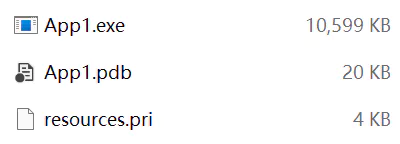
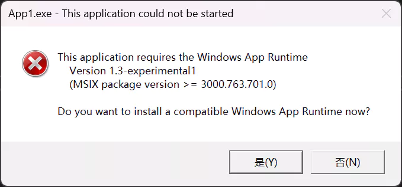
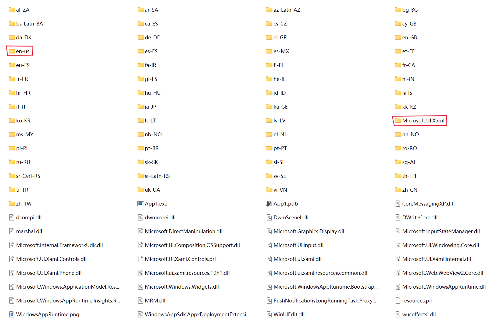

# WinUI 剪裁发布中的一个小坑

WinUI 3 （以下简称 WinUI）框架发布后的二进制文件过大的问题存在了很长时间，我在[这篇文章]()中有过详细的讨论，好在 [Windows App SDK v1.2](https://learn.microsoft.com/windows/apps/windows-app-sdk/stable-channel#trimming-for-apps-developed-with-net) 就已经支持剪裁发布，但是我却一直没有成功实现，直到最近才发现了问题所在。

## 坑在哪

在 WinUI 上使用云母或亚克力材质的时候，一般会照抄[微软文档中提供的方法](https://learn.microsoft.com/windows/apps/windows-app-sdk/system-backdrop-controller#example-use-mica-in-a-windows-appsdkwinui-3-app)。问题就出在这，这一页最后更新于 2022-09-24，那时 WinUI 还不支持剪裁，文档中的方法自然不会有问题。

``` cs
// 仅包含关键代码
class WindowsSystemDispatcherQueueHelper
{
    // ...

    object m_dispatcherQueueController = null;

    [DllImport("CoreMessaging.dll")]
    private static extern int CreateDispatcherQueueController([In] DispatcherQueueOptions options, [In, Out, MarshalAs(UnmanagedType.IUnknown)] ref object dispatcherQueueController);

    // 此方法在设置云母或亚克力前调用
    public void EnsureWindowsSystemDispatcherQueueController()
    {
        // ...

        if (m_dispatcherQueueController == null)
        {
            DispatcherQueueOptions options;
            // ...
            CreateDispatcherQueueController(options, ref m_dispatcherQueueController);
        }
    }
}
```

在这里通过 P/Invoke 调用了一个外部 COM 函数，而开启剪裁后，编译器会警告：**Trim analysis warning IL2050: P/invoke method 'WindowsSystemDispatcherQueueHelper.CreateDispatcherQueueController' declares a parameter with COM marshalling. Correctness of COM interop cannot be guaranteed after trimming. Interfaces and interface members might be removed.** 剪裁后无法保证 COM 互操作的正确性，可能会删除接口和接口成员。事实证明剪裁后确实出错了。


查看函数 `CreateDispatcherQueueController` 的定义，第二个参数返回的是一个指针，同时我们也不关心 COM 对象内容的细节，那解决方法就很简单，使用 `IntPtr` 替换 `object` 即可。

``` cpp
HRESULT CreateDispatcherQueueController(
    [in]  DispatcherQueueOptions     options,
    [out] PDISPATCHERQUEUECONTROLLER *dispatcherQueueController
);
```

修改后的代码如下：

``` cs
class WindowsSystemDispatcherQueueHelper
{
    // 改为 nint
    nint m_dispatcherQueueController;
    
    [DllImport("CoreMessaging.dll")]
    // 删除互操作相关的特性
    private static extern int CreateDispatcherQueueController(in DispatcherQueueOptions options, out nint dispatcherQueueController);

    public void EnsureWindowsSystemDispatcherQueueController()
    {
        if (m_dispatcherQueueController == 0)
        {
            DispatcherQueueOptions options;
            
            _ = CreateDispatcherQueueController(options, out m_dispatcherQueueController);
        }
    }
}
```

在最新的 [Windows App SDK v1.3 实验版 1](https://learn.microsoft.com/windows/apps/windows-app-sdk/experimental-channel#xaml-backdrop-apis) 中引入了新的 API，大大简化了设置背景材质的流程，并且这个新 API 不存在上述问题。


## 发布设置

WinUI 支持了剪裁，这为我们发布小体积应用创造了条件，不过这里的坑也很多。

需要注意的是，`.NET 7` 修改了[剪裁粒度](https://learn.microsoft.com/dotnet/core/deploying/trimming/trimming-options?pivots=dotnet-7-0#trimming-granularity)的默认值，默认剪裁全部程序集，所以发布时一定要把 `TrimMode` 设置为 `partial`。这是一个比较粗糙的解决办法，可能有更优的方案，但是我没有深入研究。

WinUI 运行依赖 [Windows App Runtime](https://learn.microsoft.com/windows/apps/windows-app-sdk/downloads)，这个组件没有内置在系统中，并且更新还很频繁。当发布为 Msix 包时，无论是否上架微软商店，安装应用的过程中商店服务都会自动下载并安装 Runtime（可能会因为网络问题安装失败）。但是不上架商店的 Msix 包安装起来就很麻烦，发布为非打包的二进制程序更为合适。

发布为非打包的二进制程序时，可以选择是否包含 Windows App Runtime，如果不包含并且按照以下设置发布：

``` xml
<!--  不打包  -->
<WindowsPackageType>None</WindowsPackageType>
<!--  启用剪裁  -->
<PublishTrimmed>true</PublishTrimmed>
<TrimMode>partial</TrimMode>
<!--  自包含 .NET 运行时  -->
<SelfContained>true</SelfContained>
<!--  单文件  -->
<PublishSingleFile>true</PublishSingleFile>
<!--  关闭 ReadyToRun  -->
<PublishReadyToRun>false</PublishReadyToRun>
<!--  不包含 Windows App Runtime  -->
<WindowsAppSDKSelfContained>false</WindowsAppSDKSelfContained>
<!--  压缩发布的文件  -->
<EnableCompressionInSingleFile>true</EnableCompressionInSingleFile>
<!--  单文件包含原生库  -->
<IncludeNativeLibrariesForSelfExtract>true</IncludeNativeLibrariesForSelfExtract>
```

空模板项目最终生成三个文件，“小而美”，但是运行后会弹窗提醒下载安装 [Windows App Runtime](https://learn.microsoft.com/windows/apps/windows-app-sdk/downloads)，在这个网页中没有引导真的很难找到正确的下载链接。





如果选择发布时包含 Windows App Runtime，就不能在发布的单文件中包含原生库，否则会出现无法打开的情况，相关讨论[参考 issue](https://github.com/microsoft/WindowsAppSDK/issues/2597)。结果就是发布后的文件很繁杂，整个 Runtime 都在发布文件夹中，并且还存在着非常多的语言相关文件夹。经过我的测试只需要保留 `en-us` 和 `Microsoft.UI.Xaml` 这两个文件夹，删除其他文件夹不影响使用。这样一个空模板项目的大小最终是 58 MB。



## 总结

没有总结。

