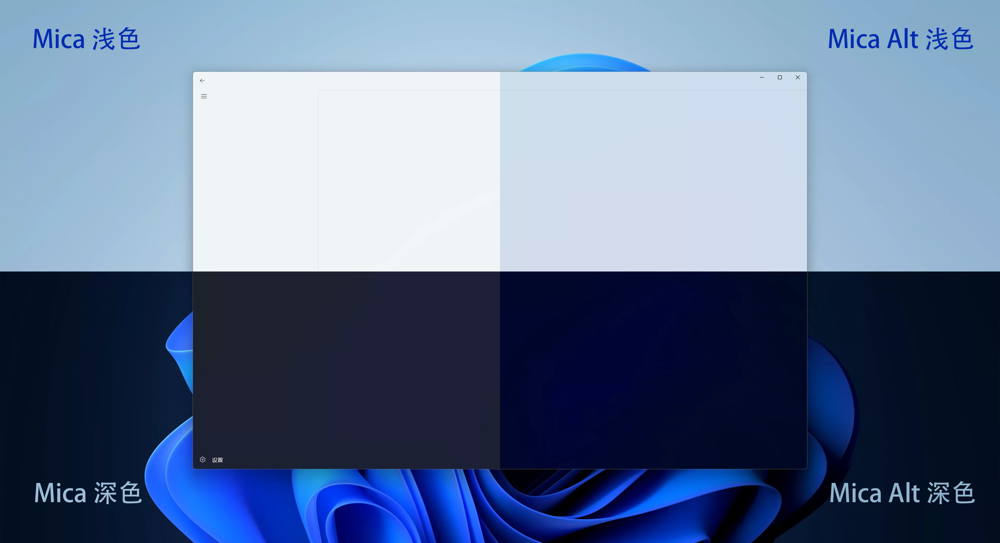

# Windows 11 新材质 Mica Alt 效果展示

> 本文是 **WinUI 3 踩坑记** 的一部分，该系列发表在 [GitHub@Scighost/WinUI3Keng](https://github.com/Scighost/WinUI3Keng)

微软在 2022-09-02 更新了官方文档，新增了 Windows 11 上的一个新材质 Mica Alt [[1]](#参考)，文档中说 Widows App SDK v1.1 能使用这个材质，可是 v1.1 在 2022-07-04 就发布了 [[2]](#参考)，到现在过了两个月才披露出来，可真能藏啊。我也在第一时间体验了 Mica Alt 的效果，下面直接上图片。

## 效果展示

> 仓库内图片经过压缩有色彩断层，在 [这里](https://www.cnblogs.com/scighost/p/16694214.html) 可以看到更好的显示效果

首先展示浅深色模式下的 Mica Alt 显示效果，其实这样看不出有什么明显的差异。

接下来把导航视图的背景去掉，然后把 Mica 和 Mica Alt 的浅深色模式放在一起对比，明显看出来 Mica Alt 更能透出壁纸的颜色。

Windows 默认的壁纸颜色变化不明显，上面的显示效果只能看出色块颜色的不同，接下来换一张壁纸，看得出来颜色的过渡部分 Mica Alt 处理得更平滑。

有点可惜的是，深色模式下对壁纸的处理不太理想，从下图中能看出来当壁纸的亮度有明显变化的部位，窗口中对应的地方存在大面积色块，没有浅色模式下那种过渡平滑的效果。

最后展示一下实际应用中存在页面内容时 Mica Alt 的显示效果。

## 写在后面

Mica 材质也能像 Acrylic 一样自定义 `FallbackColor`, `LuminosityOpacity`, `TintColor`, `TintOpacity` 等属性，这部分内容我懒得再写，就由读者自行探索了。

## 参考

- [1] [Mica](https://docs.microsoft.com/zh-cn/windows/apps/design/style/mica)
- [2] [Windows App SDK v1.1.0](https://github.com/microsoft/WindowsAppSDK/releases/tag/v1.1.0)
- [3] [在桌面应用中为 Windows 11 应用 Mica 或 Acrylic 材料](https://docs.microsoft.com/zh-cn/windows/apps/windows-app-sdk/system-backdrop-controller)