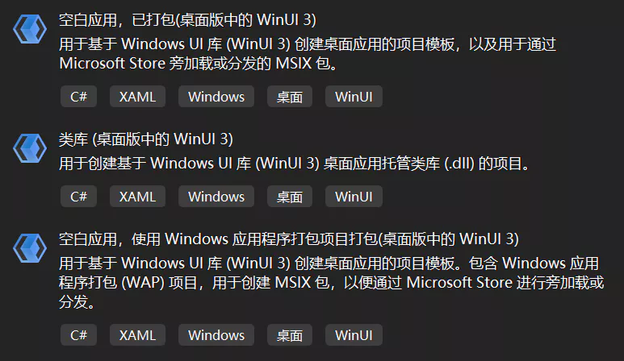
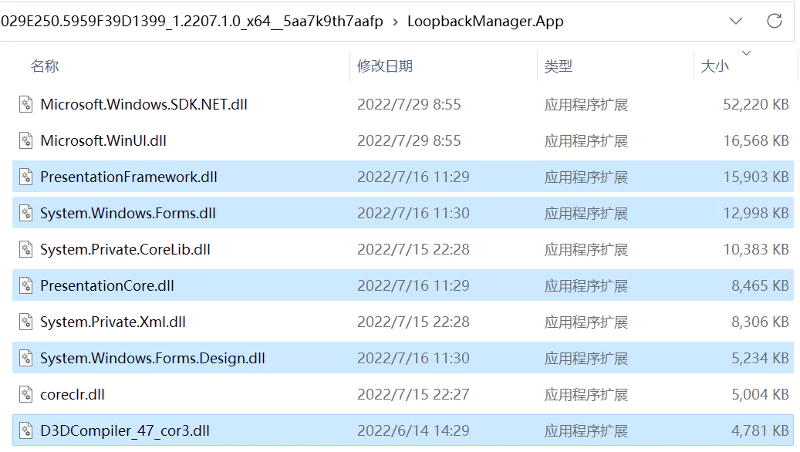

# 从创建项目到发布

> 本文是 **WinUI 3 踩坑记** 的一部分，该系列发布于 [GitHub@Scighost/WinUI3Keng](https://github.com/Scighost/WinUI3Keng)，若内容出现冲突以 GitHub 上的为准。


## 创建项目

现在 WinUI 3 的入门体验比刚发布那会儿好太多了，至少不会再出现模板项目无法生成的情况 [<sup>[1]</sup>](#引用)。打开 Visual Studio 创建 WinUI 3 项目，有如下的三个模板可以选择：

第一个模板的 WinUI 3 项目和打包项目是同一个项目，第三个模板的则是两个不同的项目。如果在发布时需要让多个可执行文件存在于不同文件夹，就选择第三个模板。




## 打包与非打包

WinUI 3 默认创建打包项目，打包发布需要使用被用户设备信任的证书给包签名，如果要发布非打包的项目，在项目文件(*.csproj)中加入以下内容即可 [<sup>[2]</sup>](#引用)。

``` xml
<!--  *.csproj  -->
<PropertyGroup>
    ......
    <!--  不打包  -->
    <WindowsPackageType>None</WindowsPackageType>
    <!--  自包含 Windows App SDK Runtime，否则需要单独安装  -->
    <WindowsAppSDKSelfContained>true</WindowsAppSDKSelfContained>
</PropertyGroup>
```

**优缺点**

|        | 优点                           | 缺点                       |
| ------ | ------------------------------ | -------------------------- |
| 打包   | 操作系统保证包内文件不会被篡改 | 需要代码签名               |
| 非打包 | 部署灵活                       | 无法使用与应用包有关的 API |


## 发布

创建项目后，会在文件夹 `./Properties/PublishProfiles/` 内创建三个不同 CPU 架构的发布配置文件，下面以 x64 平台的为例。

``` xml
<!-- win10-x64.pubxml -->
<Project ToolsVersion="4.0" xmlns="http://schemas.microsoft.com/developer/msbuild/2003">
  <PropertyGroup>
    <PublishProtocol>FileSystem</PublishProtocol>
    <Platform>x64</Platform>
    <RuntimeIdentifier>win10-x64</RuntimeIdentifier>
    <PublishDir>bin\$(Configuration)\$(TargetFramework)\$(RuntimeIdentifier)\publish\</PublishDir>
    <!-- 自包含 .NET 运行时 -->
    <SelfContained>true</SelfContained>
    <!-- 不要发布为单个文件 -->
    <PublishSingleFile>False</PublishSingleFile>
    <!-- Release 配置时使用 ReadyToRun 编译 -->
    <PublishReadyToRun Condition="'$(Configuration)' == 'Debug'">False</PublishReadyToRun>
    <PublishReadyToRun Condition="'$(Configuration)' != 'Debug'">True</PublishReadyToRun>
    <!-- 暂时不能使用剪裁 -->
    <!-- 
    See https://github.com/microsoft/CsWinRT/issues/373
    <PublishTrimmed>True</PublishTrimmed>
    -->
  </PropertyGroup>
</Project>
```

自包含和 ReadyToRun 编译让 WinUI 3 安装包的体积不逊于 Electron，尽管现在硬盘空间很宽裕，但是在打包后还是要注意一下安装包的大小，**因为第三方库可能会引入 WinForm 和 WPF 的框架文件**。

这里以[云之幻](https://github.com/Richasy)的[网络回环管理器](https://github.com/Richasy/LoopbackManager.Desktop)为例，项目中引用的第三方库仅有四个，但是安装包大小却有 90.3 MB。

``` xml
<!-- LoopbackManager.App.csproj -->
<PackageReference Include="PInvoke.User32" Version="0.7.124" />
<PackageReference Include="ReactiveUI" Version="18.3.1" />
<PackageReference Include="ReactiveUI.Fody" Version="18.3.1" />
<PackageReference Include="ReactiveUI.WinUI" Version="18.3.1" />
```


打开安装后应用的文件夹，以文件大小排序，发现几个眼熟的东西，这不就是 WinForm 和 WPF 的吗。（图中仅截取了前几个，后面还有更多）



究其原因，在项目中有这样一条引用链：`网络回环管理器 -> ReactiveUI -> DynamicData ->System.Reactive`，而在 `System.Reactive` 的项目文件中有这样一段，导致在 WinUI 3 项目中会引入 WinForm 和 WPF 的框架文件。

``` xml
<!-- System.Reactive.csproj -->
<PropertyGroup Condition="'$(TargetFramework)' == 'netcoreapp3.1' or $(TargetFramework.StartsWith('net5.0-windows'))">
    <UseWPF>true</UseWPF>
    <UseWindowsForms>true</UseWindowsForms>
    <IncludeBuildOutput Condition="'$(TargetFramework)' == 'netcoreapp3.1'">false</IncludeBuildOutput>
</PropertyGroup>
```

可惜的是，除了不引用这些第三方库以外，我暂时还没有找到在打包项目中解决这个问题的办法。


### 不同条件下的应用大小

因为有可能会引入额外的框架文件，我测试了 WinUI 3 模板项目在不同发布条件下的大小，帮各位读者排排雷。

这里的 2W 是指 WinForm 和 WPF，在我的测试中，如果仅使用 `UseWindowsForms` 或 `UseWPF` ，额外引入的框架文件是一样的，所以不对二者进行区分。

`WindowsAppSDK` 是指项目文件中 `WindowsAppSDKSelfContained = true` 的情况，用户在安装**打包项目**的安装包时(msix 或 msixbundle 文件)，系统会自动下载并安装 Windows App SDK Runtime。但是**非打包项目**没有这个福利，所以这一项仅供非打包项目参考。

|                                         | 安装包   | 安装后 |
| --------------------------------------- | -------- | ------ |
| WinUI                                   | 40.4 MB  | 101 MB |
| WinUI + ReadyToRun                      | 51.1 MB  | 138 MB |
| WinUI + WindowsAppSDK                   | 59.6 MB  | 155 MB |
| WinUI + WindowsAppSDK + ReadyToRun      | 70.3 MB  | 193 MB |
| WinUI + 2W                              | 75.5 MB  | 188 MB |
| WinUI + 2W + ReadyToRun                 | 86.2 MB  | 225 MB |
| WinUI + 2W + WindowsAppSDK              | 94.7 MB  | 242 MB |
| WinUI + 2W + WindowsAppSDK + ReadyToRun | 105.0 MB | 279 MB |


### 额外引入的内容

下表列出了额外引入 WinForm 和 WPF 框架时多出的文件或文件夹。

<details>
<summary>点击展开</summary>

| 文件或文件夹名称 |
| --- |
| cs/ |
| de/ |
| es/ |
| fr/ |
| it/ |
| ja/ |
| ko/ |
| pl/ |
| pt-BR/ |
| ru/ |
| tr/ |
| zh-Hans/ |
| zh-Hant/ |
| Accessibility.dll |
| D3DCompiler_47_cor3.dll |
| DirectWriteForwarder.dll |
| Microsoft.VisualBasic.Forms.dll |
| Microsoft.Win32.Registry.AccessControl.dll |
| Microsoft.Win32.SystemEvents.dll |
| PenImc_cor3.dll |
| PresentationCore.dll |
| PresentationFramework.Aero.dll |
| PresentationFramework.Aero2.dll |
| PresentationFramework.AeroLite.dll |
| PresentationFramework.Classic.dll |
| PresentationFramework.dll |
| PresentationFramework.Luna.dll |
| PresentationFramework.Royale.dll |
| PresentationFramework-SystemCore.dll |
| PresentationFramework-SystemData.dll |
| PresentationFramework-SystemDrawing.dll |
| PresentationFramework-SystemXml.dll |
| PresentationFramework-SystemXmlLinq.dll |
| PresentationNative_cor3.dll |
| PresentationUI.dll |
| ReachFramework.dll |
| System.CodeDom.dll |
| System.Configuration.ConfigurationManager.dll |
| System.Design.dll |
| System.Diagnostics.EventLog.dll |
| System.Diagnostics.EventLog.Messages.dll |
| System.Diagnostics.PerformanceCounter.dll |
| System.DirectoryServices.dll |
| System.Drawing.Common.dll |
| System.Drawing.Design.dll |
| System.IO.Packaging.dll |
| System.Printing.dll |
| System.Resources.Extensions.dll |
| System.Security.Cryptography.Pkcs.dll |
| System.Security.Cryptography.ProtectedData.dll |
| System.Security.Cryptography.Xml.dll |
| System.Security.Permissions.dll |
| System.Threading.AccessControl.dll |
| System.Windows.Controls.Ribbon.dll |
| System.Windows.Extensions.dll |
| System.Windows.Forms.Design.dll |
| System.Windows.Forms.Design.Editors.dll |
| System.Windows.Forms.dll |
| System.Windows.Forms.Primitives.dll |
| System.Windows.Input.Manipulations.dll |
| System.Windows.Presentation.dll |
| System.Xaml.dll |
| UIAutomationClient.dll |
| UIAutomationClientSideProviders.dll |
| UIAutomationProvider.dll |
| UIAutomationTypes.dll |
| vcruntime140_cor3.dll |
| WindowsFormsIntegration.dll |
| wpfgfx_cor3.dll |

</details>


## 引用

- [1] [WindowsAppSDK: .NET 6 and WINUI3 fails to start Unable to load DLL 'Microsoft.ui.xaml.dll'](https://github.com/microsoft/WindowsAppSDK/issues/1762)
- [2] [非 MSIX 打包：为非 MSIX 打包的 C# 或 C++ WinUI 3 桌面应用创建一个新项目](https://docs.microsoft.com/zh-cn/windows/apps/winui/winui3/create-your-first-winui3-app#non-msix-packaged-create-a-new-project-for-a-non-msix-packaged-c-or-c-winui-3-desktop-app)

