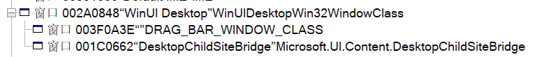

# 第一个窗口

> 本文是 **WinUI 3 踩坑记** 的一部分，该系列发布于 [GitHub@Scighost/WinUI3Keng](https://github.com/Scighost/WinUI3Keng)，若内容出现冲突以 GitHub 上的为准。

WinUI 3 应用的入口和 UWP 类似，也是继承自 `Application` 的一个类，略有不同的是没有 UWP 那么多的启动方式可供重写，只有一个 `OnLaunched` 可以重写。`OnLaunched` 中的内容很简单，就是构造一个主窗口并激活。

``` cs
// App.xaml.cs

public partial class App : Application
{
    public App()
    {
        this.InitializeComponent();
    }

    protected override void OnLaunched(Microsoft.UI.Xaml.LaunchActivatedEventArgs args)
    {
        // 构造一个主窗口并激活
        m_window = new MainWindow();
        m_window.Activate();
    }

    private Window m_window;
}
```

本文将聚焦于主窗口 `MainWindow`，介绍 `设置云母或亚克力背景`、`调整窗口位置大小`、`自定义标题栏` 等内容。


## 设置云母或亚克力背景

设置背景材质的方法在[官方文档](https://learn.microsoft.com/zh-cn/windows/apps/windows-app-sdk/system-backdrop-controller)中有很详细的方法，不再过多介绍，本文中使用的是我个人封装的方法，[源码在这](https://github.com/Scighost/WinUILib/blob/main/WinUILib/Helpers/SystemBackdropHelper.cs)。

``` cs
// MainWindow.xaml.cs
using Scighost.WinUILib.Helpers;

private SystemBackdropHelper backdropHelper;

public MainWindow()
{
    this.InitializeComponent();
    backdropHelper = new SystemBackdropHelper(this);
    // 设置云母背景，如果不支持则设置为亚克力背景
    backdropHelper.TrySetMica(fallbackToAcrylic: true);
}

```


## 调整窗口位置大小

创建窗口后的第一件事儿是干什么？    
没错，就是**获取窗口句柄(HWND)**，这个流程和 WPF/UWP 截然不同，倒是和 Win32 很像。因为窗口类 `Microsoft.UI.Xaml.Window` 中几乎没有与窗口状态有关的方法，而所谓的 HWND **高级封装**类 `Microsoft.UI.Windowing.AppWindow` 包含的方法也很有限，并且需要通过窗口句柄才能获取。相比之下 WPF 几乎封装了所有关于窗口的常见操作，可见 WPF 在开发体验方面更胜一筹。

``` cs
// MainWindow.xaml.cs
// 命名空间真™乱
using Microsoft.UI;
using Microsoft.UI.Windowing;
using Microsoft.UI.Xaml;
using WinRT.Interop;

private IntPtr hwnd;
private AppWindow appWindow;

public MainWindow()
{
    this.InitializeComponent();
    hwnd = WindowNative.GetWindowHandle(this);
    WindowId id = Win32Interop.GetWindowIdFromWindow(hwnd);
    appWindow = AppWindow.GetFromWindowId(id);
}

```

WinUI 3 不会自动保存窗口大小和位置，这个功能需要自己实现，也没有窗口最大化的方法，需要调用 Win32 Api。

``` cs
// MainWindow.xaml.cs
using Vanara.PInvoke;
using Windows.Graphics;

// 窗口最大化
User32.ShowWindow(hwnd, ShowWindowCommand.SW_SHOWMAXIMIZED);
// 调整窗口位置和大小，以屏幕像素为单位
appWindow.MoveAndResize(new RectInt32(_X: 560, _Y: 280, _Width: 800, _Height: 600));
```

一般流程为在窗口关闭时保存位置和大小，启动时加载保存的设置，这里我们使用 [应用包的设置功能](https://learn.microsoft.com/zh-cn/windows/apps/design/app-settings/store-and-retrieve-app-data)，但是该 Api 能够存储的数据类型不包括 `Windows.Graphics.RectInt32`，稍微对数据模型做一些调整。

> 注意：非打包应用不能使用应用包的设置功能

``` cs
// MainWindow.xaml.cs
using Microsoft.UI.Windowing;
using Vanara.PInvoke;
using Windows.Graphics;
using Windows.Storage;
using System.Runtime.InteropServices;

public sealed partial class MainWindow : Window
{
    ......
    
    public MainWindow()
    {
        ......

        // 初始化窗口大小和位置
        this.Closed += MainWindow_Closed;
        if (ApplicationData.Current.LocalSettings.Values["IsMainWindowMaximum"] is true)
        {
            // 最大化
            User32.ShowWindow(hwnd, ShowWindowCommand.SW_SHOWMAXIMIZED);
        }
        else if (ApplicationData.Current.LocalSettings.Values["MainWindowRect"] is ulong value)
        {
            var rect = new WindowRect(value);
            // 屏幕区域
            var area = DisplayArea.GetFromWindowId(windowId: id, DisplayAreaFallback.Primary);
            // 若窗口在屏幕范围之内
            if (rect.Left > 0 && rect.Top > 0 && rect.Right < area.WorkArea.Width && rect.Bottom < area.WorkArea.Height)
            {
                appWindow.MoveAndResize(rect.ToRectInt32());
            }
        }
    }

    private void MainWindow_Closed(object sender, WindowEventArgs args)
    {
        // 保存窗口状态
        var wpl = new User32.WINDOWPLACEMENT();
        if (User32.GetWindowPlacement(hwnd, ref wpl))
        {
            ApplicationData.Current.LocalSettings.Values["IsMainWindowMaximum"] = wpl.showCmd == ShowWindowCommand.SW_MAXIMIZE;
            var p = appWindow.Position;
            var s = appWindow.Size;
            var rect = new WindowRect(p.X, p.Y, s.Width, s.Height);
            ApplicationData.Current.LocalSettings.Values["MainWindowRect"] = rect.Value;
        }
    }

    /// <summary>
    /// RectInt32 和 ulong 相互转换
    /// </summary>
    [StructLayout(LayoutKind.Explicit)]
    private struct WindowRect
    {
        [FieldOffset(0)]
        public short X;
        [FieldOffset(2)]
        public short Y;
        [FieldOffset(4)]
        public short Width;
        [FieldOffset(6)]
        public short Height;
        [FieldOffset(0)]
        public ulong Value;

        public int Left => X;
        public int Top => Y;
        public int Right => X + Width;
        public int Bottom => Y + Height;

        public WindowRect(int x, int y, int width, int height)
        {
            X = (short)x;
            Y = (short)y;
            Width = (short)width;
            Height = (short)height;
        }

        public WindowRect(ulong value)
        {
            Value = value;
        }

        public RectInt32 ToRectInt32()
        {
            return new RectInt32(X, Y, Width, Height);
        }
    }

}
```

到此为止已经完成了窗口状态的全部功能。


## 自定义标题栏

自定义标题栏是每个应用都应该做的事情，毕竟窗口顶部突然出现一个孤零零白条多少有点煞风景。


WinUI 3 提供了两种方法自定义标题栏，有关这两种方法更详细的内容，请看[文档](https://learn.microsoft.com/zh-cn/windows/apps/develop/title-bar)。

### 使用 Window 自带的属性

通过设置 `Window.ExtendsContentIntoTitleBar = true` 将客户区内容扩展到标题栏，用法比较简单，然后还需要调用 `SetTitleBar(UIElement titleBar)` 告诉系统可拖动区域的范围，这里的 `titleBar` 是在 xaml 文件中定义的控件，调用此 Api 后会将控件覆盖的部分设置为可拖动区域。

``` cs
// MainWindow.xaml.cs
using Microsoft.UI.Xaml;

this.ExtendsContentIntoTitleBar = true;
this.SetTitleBar(AppTitleBar);
```

``` xml
<!-- MainWindow.xaml -->
<Grid>
    <Border x:Name="AppTitleBar"
            Height="48"
            VerticalAlignment="Top">
        <TextBlock VerticalAlignment="Center" Text="WinUI Desktop" />
    </Border>
</Grid>
```

``` xml
<!-- App.xaml -->
<!-- 右上角按键的背景色设置为透明 -->
<StaticResource x:Key="WindowCaptionBackground" ResourceKey="ControlFillColorTransparentBrush" />
<StaticResource x:Key="WindowCaptionBackgroundDisabled" ResourceKey="ControlFillColorTransparentBrush" />
```

不过这个方法存在两个问题：

**第一**，使用 `SetTitleBar` 设置的可拖动区域必须是一块完整的区域，并且处于该范围内的所有控件不能再被点击，所以使用这个方法不能实现微软商店那种标题栏中嵌入搜索框的功能。

为了一探究竟，使用 Spy++ 查看窗口的属性，如下图所示。



这里的 `WinUI Desktop` 是主窗口，内部有两个子窗口，从名称可以看出来 `DRAG_BAR_WINDOW_CLASS` 和拖动功能相关，查看它的大小和位置，刚好是前面使用 `SetTitleBar` 设置的范围（系统缩放率 150%）。第二个 `DesktopChildSiteBridge` 则是托管 UI 内容的 Xaml Island。


由此可以得出结论，对自定义标题栏的鼠标操作会传递到 `DRAG_BAR_WINDOW_CLASS`，而 `DesktopChildSiteBridge` 不会收到相关消息，所以该区域下的所以控件都无法被点击，该原理也决定了可拖动区域只能为矩形。使用 Spy++ 查看窗口消息内容也证明了这一点（图略）。

**第二**，点击右上角三个按键后操作无法取消，即使把鼠标移开后，松开按键时也会触发操作，具体的行为可以查看这个 [issue](https://github.com/microsoft/microsoft-ui-xaml/issues/7259)。


### 使用 AppWindowTitleBar

`AppwindowTitleBar` 是 Windows 11 上的方法，相比前者可以设置多个可拖动区域，这使得标题栏的控件交互操作成为可能。并且如果不主动设置可拖动区域，那么原标题栏的区域则会自动成为可拖动区域。

``` cs
// MainWindow.xaml.cs

// 检查是否支持此方法
if (AppWindowTitleBar.IsCustomizationSupported())
{
    // 不支持时 titleBar 为 null
    titleBar = appWindow.TitleBar;
    titleBar.ExtendsContentIntoTitleBar = true;
    // 标题栏按键背景色设置为透明
    titleBar.ButtonBackgroundColor = Colors.Transparent;
    titleBar.ButtonInactiveBackgroundColor = Colors.Transparent;
}
```

当手动设置可拖动区域时，一定要注意系统缩放率的问题，`AppwindowTitleBar` 设置的区域是以像素为单位，而 UI 中的控件会受到缩放率的影响变得更大，设置可拖动区域时需要手动乘上缩放率。

``` cs
// MainWindow.xaml.cs
using Windows.Graphics;
using Vanara.PInvoke;

// 获取系统缩放率
var scale = (float)User32.GetDpiForWindow(hwnd) / 96;
// 48 这个值是应用标题栏的高度，不是唯一的，根据自己的 UI 设计而定
titleBar.SetDragRectangles(new RectInt32[] { new RectInt32(0, 0, 10000, (int)(48 * scale)) });
```

为什么要把可拖动区域的宽度设置为 10000 呢？如果设置小了标题栏右侧没有覆盖到的部分就会无法拖动，设置大了却不会影响右上角的三个键（不会有人的显示器像素宽度大于 10000 吧）。

### 修改可拖动区域

在很多情况下需要修改可拖动区域，最常见的就是窗口宽度变小时，`NavigationView` 的菜单按键会跑到上面，下图中三横线按键。


如果是使用 `Window.SetTitleBar`，那么修改可拖动区域将会非常简单，直接修改 `AppTitleBar` 控件的边界大小就行，还无需考虑系统缩放率的影响。

``` cs
AppTitleBar.Margin = new Thickness(96, 0, 0, 0);
```

如果是使用 `AppWindowTitleBar.SetDragRectangles`，那么问题就来了，看下面这张图片，如果先把橙色方框的范围设置为可拖动区域，然后再把蓝色方框的范围设置为可拖动区域，这时候会发生什么？


答案是蓝色方框可以拖动，但是绿色方框既不能拖动，也不能点击。这是 WindowsAppSDK v1.1 版本的一个 Bug，这个 Bug 基本上断绝了在标题栏上修改控件布局的可能性。每次修改可拖动区域前可以通过调用 `AppWindowTitleBar.ResetToDefault()` 解决这个问题，但是那样会有系统标题栏突然出现然后消失的情况，非常影响体验。有关这个 Bug 的更详细的内容可以查看 **爱奇艺 Preview** 的开发者 [kingcean](https://github.com/kingcean) 提出的 [issue](https://github.com/microsoft/WindowsAppSDK/issues/2574)，issue 中提到了 `v1.2 preview 1` 解决了这个 Bug，经过我的测试确实解决了。

### v1.2 Preview 1 新功能

v1.2 preview 1 的更新内容中有提到已支持在 Windows 10 中使用 `AppWindowTitleBar`，在我的测试中 `ExtendsContentIntoTitleBar` 已可以使用并且成功将客户区扩展到了标题栏。但是无论是否调用 `SetDragRectangles` 都无法拖动该窗口（参考这个 [issue](https://github.com/microsoft/WindowsAppSDK/issues/2976)），等后续修复吧。


## 总结

WinUI 3 在窗口操作上比 WPF/UWP 麻烦了不少，许多常用的操作都没有封装，比如 `最大最小化`、`隐藏窗口` 等。又因为在窗口上设计思路的不同，使得很多功能需要通过**窗口句柄**这个本应该被隐藏掉的东西去实现，这就是为什么我要在前言中写下了解 Win32 窗口相关知识。

人家微软也有理由说的，我开发的是什么框架，是最新一代的框架；你让我封装的是什么东西，是 Win32 的老古董。哦哟，谢天谢地了。WinUI 3 现在什么水平，改个窗口都这么麻烦，它能火吗？火不了，没这个能力知道吗。有 WPF 珠玉在前，拿什么跟人家比，不被砍掉就算成功了。


